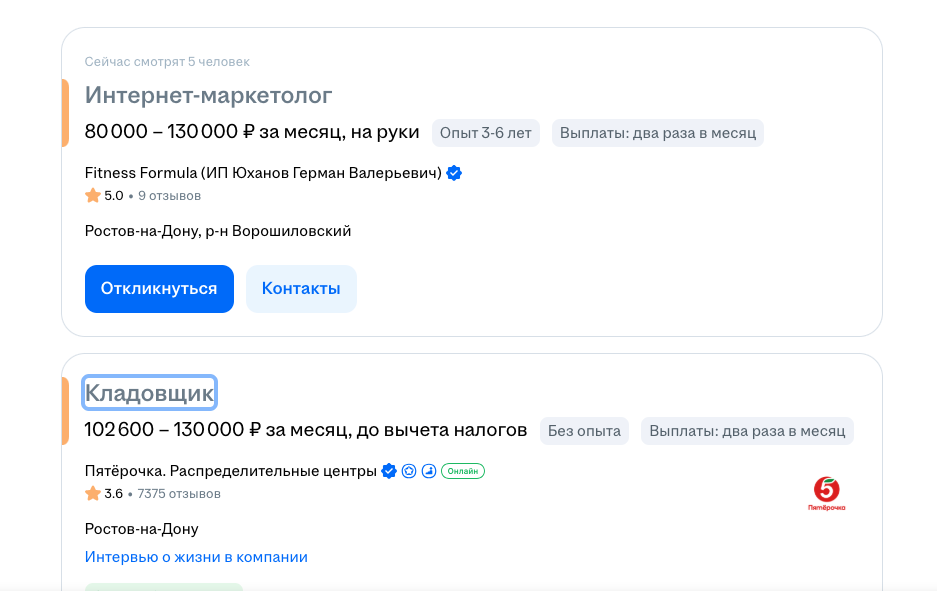
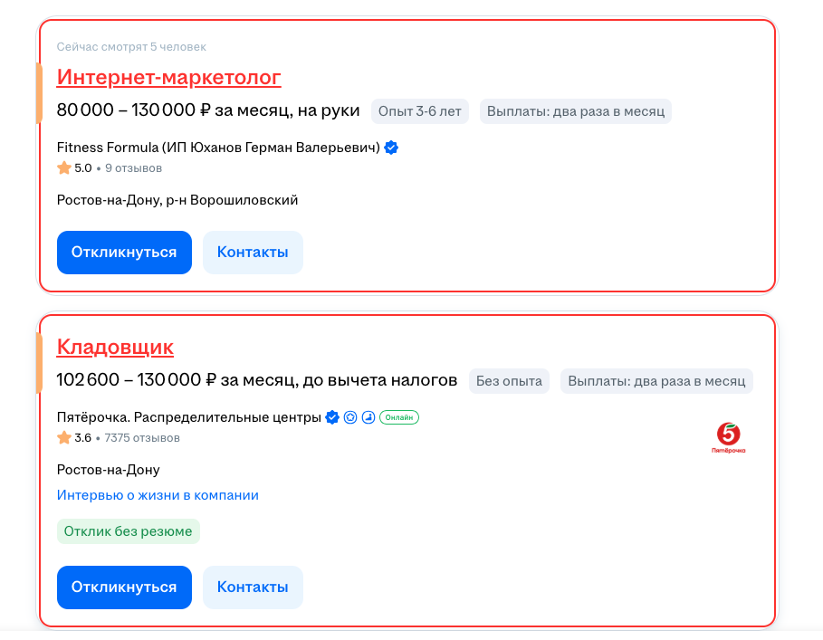

# HH Visited Highlighter 🚀

**HH Visited Highlighter** — лёгкое расширение для Chrome/Firefox, которое подсвечивает посещённые вакансии и резюме на [hh.ru](https://hh.ru) выбранным цветом (по умолчанию `#d32f2f`).  
Больше никакой путаницы: сразу видишь, где уже был, с историей и бейджем на иконке!

🌐 **Сайт:** https://code.apofeouz.ru/hh-highlighter/ — ленд, скриншоты и история · **Хаб:** https://code.apofeouz.ru/

---

## ✨ Возможности

- Подсветка **заголовка вакансии/резюме** + рамка вокруг карточки (цвет на выбор, 6 пресетов, live без перезагрузки).
- **Popup** по клику на иконку: вкл/выкл, выбор цвета, счётчик.
- **История просмотров**: последние 5 в попапе + полная страница `history.html` с поиском, датами и удалением.
- **Бейдж** на иконке с количеством отмеченных (белый на `#d32f2f`, обновляется автоматически).
- **Onboarding** при установке — как закрепить иконку 📌.
- Работает даже если ссылка `hh.ru` меняется (динамические параметры, `adsrv`).
- Подсветка сохраняется при обновлении и `pageshow`.

---

## 📸 Скриншоты

До:  


После:  


Попап и история:  
 — в попапе счётчик, цвет и последние просмотренные; `Вся история` открывает `history.html`.

## ⚙️ Установка вручную

1. Скачай архив из [Releases](https://github.com/apofeouz/hh-highlighter/releases) или клонируй:
   ```bash
   git clone https://github.com/apofeouz/hh-highlighter.git
   ```
2. Открой `chrome://extensions/` → включи **Режим разработчика**.
3. Нажми **Загрузить распакованное** → выбери папку с проектом.
4. Готово 🎉 Закрепи иконку (🧩 → 📌) чтобы видеть бейдж и цвет.

---

## 🚀 Установка из Store

👉 [HH Highlighter — Chrome Web Store](https://chromewebstore.google.com/detail/bgmokfidjolcodaacpkjaoihldgldkko?utm_source=item-share-cb)

🌐 Ленд: https://code.apofeouz.ru/hh-highlighter/

---

## 🚀 Roadmap

**v1.0 (готово)**
- Подсветка просмотренных вакансий/резюме, Manifest V3, иконки, скрины, публикация в Store.

**v1.1 (готово, 1.1.3)**
- ✅ Popup с вкл/выкл и выбором цвета (`#d32f2f` по умолчанию)
- ✅ Бейдж с счётчиком + onboarding
- ✅ История с `chrome.storage.local` (recent в попапе + `history.html`)

**v1.2 (в работе)**
- Экспорт/импорт настроек (JSON) — issue #3
- Поддержка других сайтов (Superjob и др.) — issue #4
- Опции скрытия/бледности посещённых — issues #8, #9

**v2.0**
- Firefox Add-ons ( `browser_specific_settings` уже в `manifest.json`)
- Дата последнего просмотра, разные цвета для статусов

---

## 🛠️ Технологии

- Manifest V3 + `action` + `background service_worker`
- JavaScript (Content Scripts, `chrome.storage.sync` для настроек, `chrome.storage.local` для истории)
- `localStorage` (legacy, мигрируется в `hh_history`)

---

## 🤝 Поддержка

Если полезно — поставь ⭐ на GitHub и поделись с друзьями 😉  
Угостить кофе: [ЮMoney](https://yoomoney.ru/to/41001166778763)

## Version

Актуальная версия: **1.1.3**  
Смотрите [manifest.json](manifest.json) и [Releases](https://github.com/apofeouz/hh-highlighter/releases).
